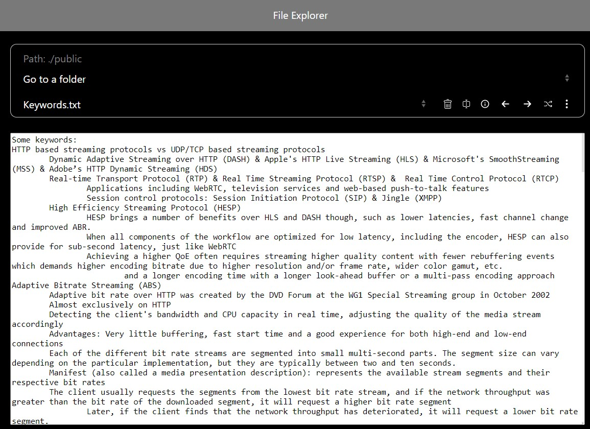
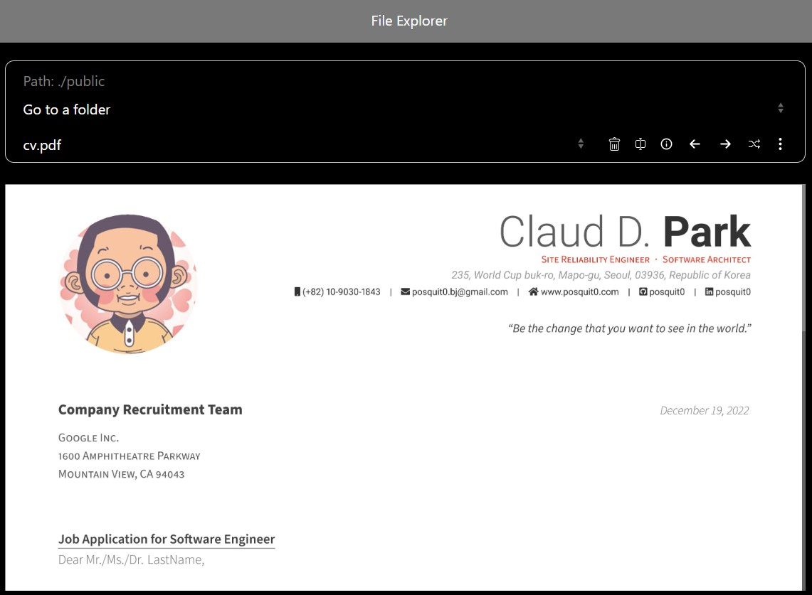
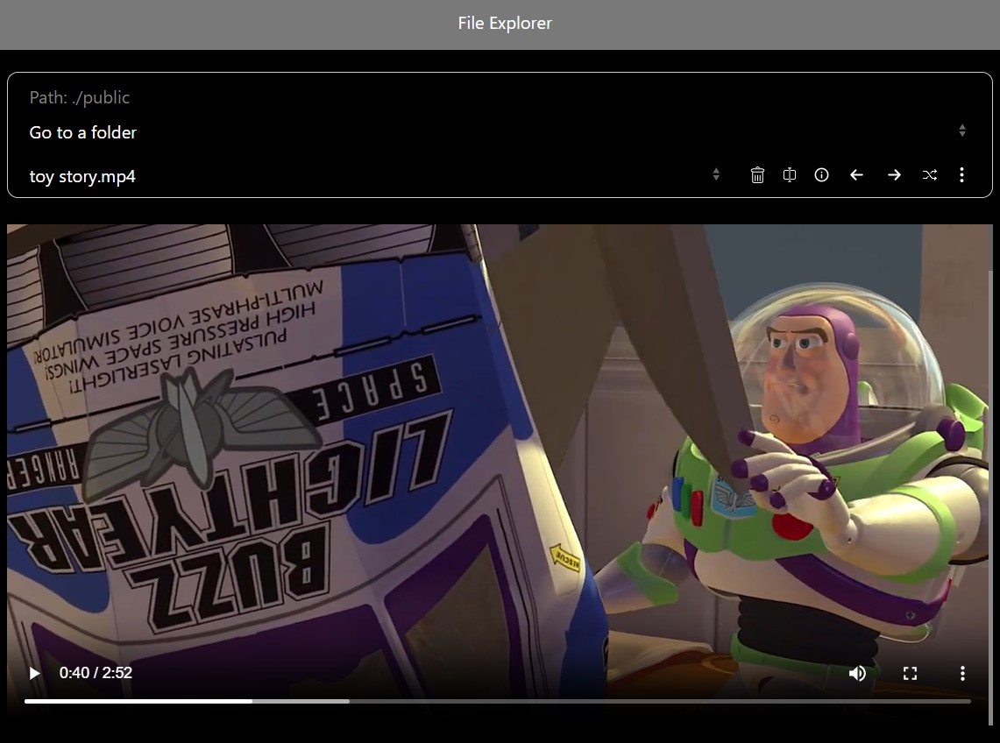
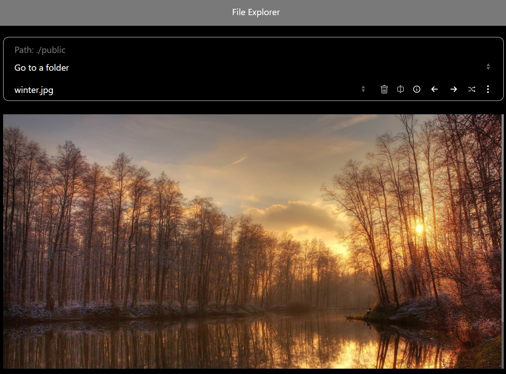

## What is this
  
I created this web-based file-explorer application in Java Spring, HTML, CSS and Javascript, to make it possible to simply manage the files over the network to open, edit (text files), download, upload, share, stream videos, create files and folders, execute commands, etc.

## How to use
1. Build application with "mvn package -DskipTests"
2. Run application with "java -jar target/file-explorer-1.jar"
3. Use Firefox or Chrome to open https://localhost/ 

## About
Masoud Taghavian (masoud.taghavian@gmail.com)  
Enjoy!

## Screenshots

